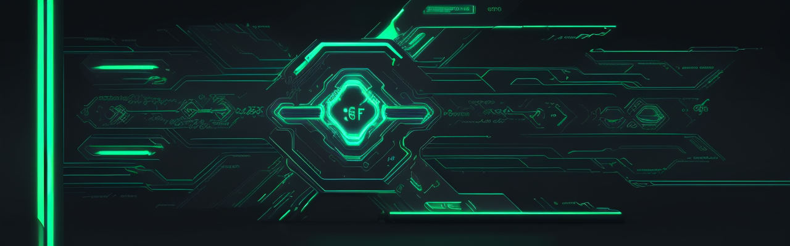
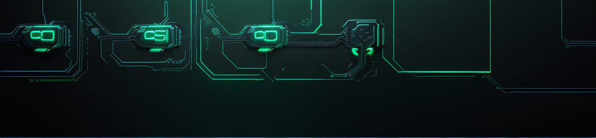
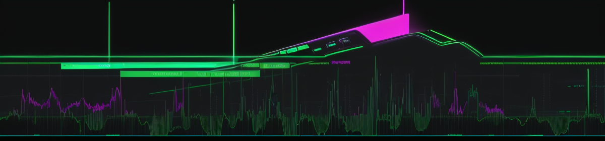
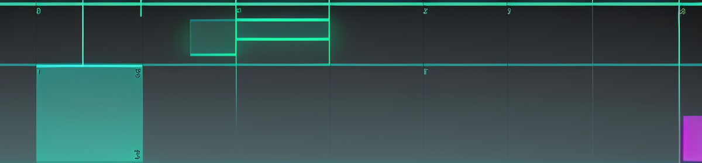
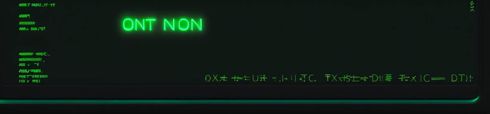
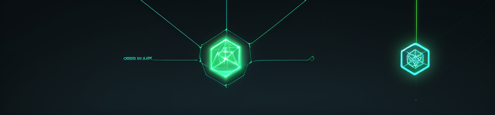

<p align="center">
  
</p>

<p align="center">
  
</p>

<h1 align="center">VirusGPT</h1>

<p align="center">
  <b>Offline · Local · Private</b> AI agent platform.<br>
  A desktop app that runs the whole thing on your machine — no cloud, no login.
</p>

<p align="center">
  <a href="LICENSE"></a>
  
  
</p>

---



## What it is

VirusGPT is a **local AI workstation** — a native desktop app wrapping a FastAPI
backend, a memory graph, and a multi-agent mission board.

Everything stays on your machine:
- no cloud API needed for the core flow
- no account, no login
- no data leaves by default
- your personas, chats, memory, and missions are local

The **desktop app is the main screen**. On macOS it lands in `/Applications/VirusGPT.app`
and runs its own backend (self-contained). Windows and Linux build scripts ship the same
app for those platforms.

---



## Features

- **Native desktop app** — pywebview shell; backend runs in-process. Built with
  PyInstaller for macOS, Windows, Linux.
- **Multi-persona chat** — rooms, persona lineups, LLM / mention / random routing.
- **Voice, sentence by sentence** — each reply splits into sentences with its own ▶
  button, plus ⏯ play-all and ⟲ replay. Auto-play streams one at a time (no loops).
  Audio is tied to its chat and cleared when the session is removed.
- **Talk to it** — Whisper STT (mic) in the app; works over HTTPS on mobile too.
- **Autonomous missions** — multi-agent work on a live kanban board with a tool log.
  `/studio` or `/mission` spins up an image team that renders a full asset kit.
- **Images via ComfyUI** — one 🎨, or a whole kit via `/studio` `/mission`. Rendered by
  your local **ComfyUI**.
- **Memory graph** — a local concept graph with health stats and detail editing.
- **In-app updater** — tap the version chip, see the running build, pull + rebuild +
  replace when a newer commit exists.
- **Settings & themes** — backend, model, voice, timeouts; Cyber Matrix / Amber Gears /
  Ice Neon.

---



## Requirements

- **Ollama** — the chat/model brain (runs locally)
- **PocketTTS** — voice out
- **Whisper** — voice in
- **ComfyUI** — image generation

Set these in the in-app **Settings** panel or `config.json`.

---


## Desktop app

**macOS (primary):**
```bash
open /Applications/VirusGPT.app
```

**From source (dev):**
```bash
cd virusgpt-mac
.venv/bin/python desktop/run.py
```

**Rebuild the bundle:**
```bash
.venv/bin/python desktop/build-macos.py
```
Builds, stamps the git version + commit, and installs to `/Applications/VirusGPT.app`
(falls back to a repo `apps/` copy if needed). Writes `app/version.json` +
`app/buildinfo.json` so the updater knows where to rebuild from.

Windows / Linux: `desktop/build-windows.py` / `desktop/build-linux.py`.

**Two modes:**
- **Self-contained** (default) — backend bundled, starts in-process.
- **Remote backend** — set `desktop.backend_url` in `config.json` and the app becomes a
  thin client to a backend elsewhere (e.g. Docker).

---



## Quick start (server + voice)

`launch.sh` starts the local stack (server, PocketTTS, Whisper):
```bash
./launch.sh
```
Server only:
```bash
.venv/bin/python server.py
```
Then open `http://localhost:8500`.

---



## CLI: `vgctl.py`

```bash
.venv/bin/python vgctl.py health
.venv/bin/python vgctl.py doctor
.venv/bin/python vgctl.py fix --kill-ports
.venv/bin/python vgctl.py settings set ollama.default_model qwen2.5:3b
```

---


## Docker (optional)

```bash
docker compose up -d --build
```
Web `:8500` · TTS `:49152` · STT `:8181` · Ollama `:11434`.

---



## Project layout

```text
virusgpt-mac/
├── server.py          # FastAPI: chat, memory, missions, images
├── config.json        # backend / model / theme / services
├── launch.sh          # one-shot local stack
├── desktop/           # native shell + build scripts (mac/win/linux)
├── app/               # frontend HTML/CSS/JS + images
├── autonomous/        # mission runtime
├── memory/            # memory graph store
├── gateway/           # heartbeat / cron / recovery
├── pockettts/         # TTS server
├── whisper/           # STT server
├── services/          # comfyui / stt / tts / config clients + updater
└── docs/              # architecture, status, roadmap, audits
```

---


## How it fits together

- **Desktop-first** — the app frames the web UI and starts the backend.
- **Local by default** — personas, chats, memory persist on disk.
- **ComfyUI for images** — every picture comes from your local ComfyUI via `/api/generate`.
- **Mission-driven** — long jobs use the kanban flow, not a hidden auto-chat.
- **No bundler** — plain ES modules, loaded in order.

---

## Testing

```bash
.venv/bin/activate
python -m pytest tests/ -q
```
`test_backend.py` (endpoints, ComfyUI + path guards, updater) · `test_frontend.py`
(Playwright: per-sentence ▶, no-loop play-all, streaming-once, session-audio prune, team
round, images, responsive) · `test_split_sentences.py`. **80 tests passing.**

---

## Docs

| Path | About |
|------|-------|
| `autonomous/` | mission runtime, lifecycle, recovery |
| `pockettts/` | TTS server + voices |
| `whisper/` | STT server, model/device |
| `memory/` | memory graph store |
| `gateway/` | heartbeats, cron, auto-revive |
| `desktop/` | native shell + packaging |
| `services/` | local service clients |
| `docs/` | STATUS · AUDIT · OPTIMIZATION · ROADMAP · UI_AUDIT |

---

## License

Released under the [MIT License](LICENSE). © 2026 TheGMPTeam.
