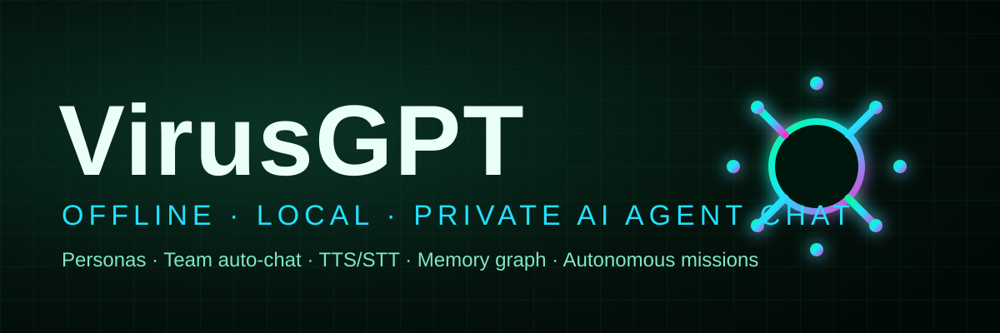

<p align="center">
  
</p>

<p align="center">
  
</p>

<h1 align="center">VirusGPT</h1>

<p align="center">
  <b>Offline · Local · Private</b> AI agent chat — personas, team auto-chat, TTS/STT, a memory graph, and autonomous missions.
  <br>Everything runs on your own machine (Ollama + PocketTTS + Whisper). No cloud, no accounts, no data leaves the box.
</p>

<p align="center">
  <a href="LICENSE"></a>
  
</p>

---

## ✨ Features

- **Multi-persona chat** — switch, create, and clone voices for each persona. The LLM decides who answers, or you pick.
- **Team auto-chat** — a Planner decomposes a task (silently) and Workers execute in-chat with TTS. Triggers: `/team <task>`, `@team`, `team:`, `#team`.
- **AI suggestions & Improve** — free-text typing shows AI completion chips; the ✨ Improve button rewrites your draft.
- **Voice** — sentence-streamed TTS (PocketTTS) with no-overlap playback, plus Whisper STT via the mic button.
- **Memory graph** — OKF-style knowledge-graph stats with a radial visualizer.
- **Autonomous missions** — long-running multi-agent goals streamed via SSE.
- **Theming** — Cyber Matrix / Amber Gears / Ice Neon, with a matrix-rain background.

## 🚀 Quick start

```bash
# 1. (macOS) install & launch the local AI stack
./launch.sh            # starts the server on :8500 and PocketTTS on :49152

# …or run the server directly inside the venv
python -m venv .venv && .venv/bin/pip install -r requirements.txt
.venv/bin/python server.py
```

Open <http://localhost:8500>. Requires a local Ollama with `qwen2.5:3b` (and any
persona voices) plus a running PocketTTS instance for voice.

> Configure the backend, model, default voice, and think-time-out in the in-app
> **⚙ Settings** panel.

## 🗂 Project layout

The frontend was refactored out of a single `index.html` into focused modules:

```
virusgpt-mac/
├── server.py                 # FastAPI server (chat SSE, TTS/STT, memory, missions, /assets)
├── config.json               # backend / title / default theme
├── launch.sh                 # one-shot local stack launcher
├── requirements.txt
├── assets/
│   ├── images/               # logo.svg, logo.png, favicon.svg/png, hero.svg
│   ├── css/
│   │   └── styles.css        # full theme (cyber / amber / ice)
│   └── js/
│       ├── config.js         # globals, API base, personas/rooms state, localStorage
│       ├── utils.js          # $, tabs, health probe, themes, matrix rain
│       ├── tts.js            # sentence-streamed TTS + serial drain
│       ├── messages.js       # markdown strip, sentence split, bubble render, replay
│       ├── personas.js       # room lineup + Personas management tab (clone/save/delete)
│       ├── sessions.js       # Sessions panel: switch / create / rename / remove / save
│       ├── chat.js           # send(), persona routing, slash commands, streaming turn
│       ├── autocomplete.js   # / @ # popup + AI suggestion chips + Improve button
│       ├── team.js           # planner→workers→synthesis auto-chat + stop-all
│       ├── memory.js         # OKF graph stats + radial canvas
│       ├── ui.js             # settings modal, input wiring, mic, missions panel
│       └── main.js           # boot() + init order
├── pockettts/                # bundled PocketTTS voice server (separate subproject)
└── services/                 # server-side services (llm, tts, stt, memory, config)
```

`index.html` is now a thin shell: it carries the markup and loads the CSS +
JS modules in dependency order (`config → utils → tts → messages → personas →
sessions → chat → autocomplete → team → memory → ui → main`).

## 🧩 Architecture notes

- **No build step.** Plain ES (no bundler) — the `<script>` tags load in order, so
  `config.js` globals (`$`, `API`, `personas`, `rooms`, …) are available to later files.
- **State** lives in `localStorage` (`vg_personas`, `vg_rooms`) and is mirrored to the
  server where the API allows (personas).
- **Server** serves `app/index.html` and mounts `app/assets` at `/assets`.

## 📜 License

Released under the [MIT License](LICENSE). © 2026 TheGMPTeam.
